# Php-Crash-Course

## 1. Variables & Types

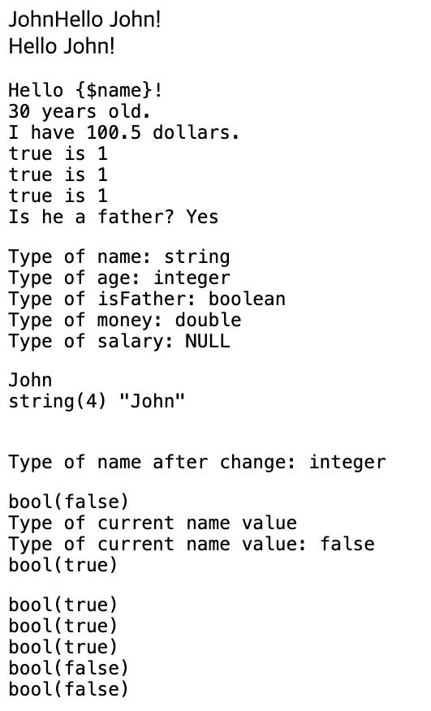

## 2. String

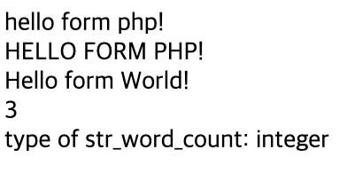

## 3. Numbers

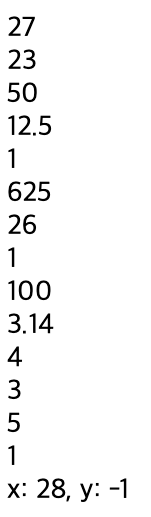

## 4. Arrays & loops

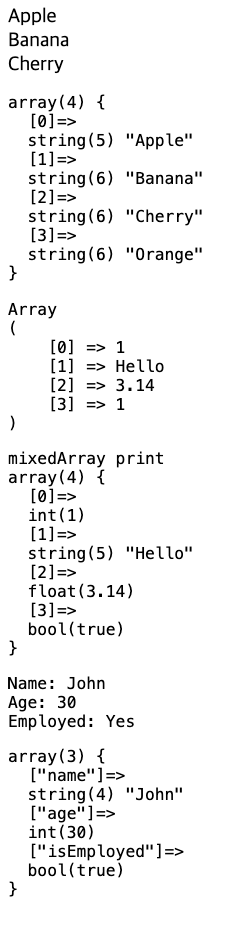

## 5. Conditionals

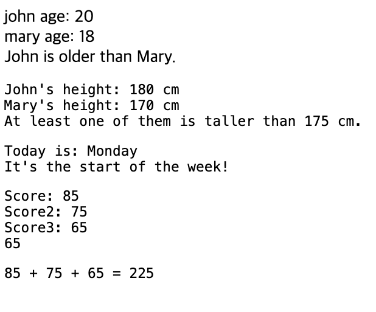

## 6. Loops

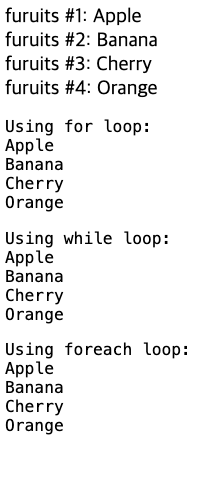

## 7. Functions

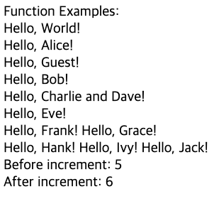

## 7. Form & Vaildating

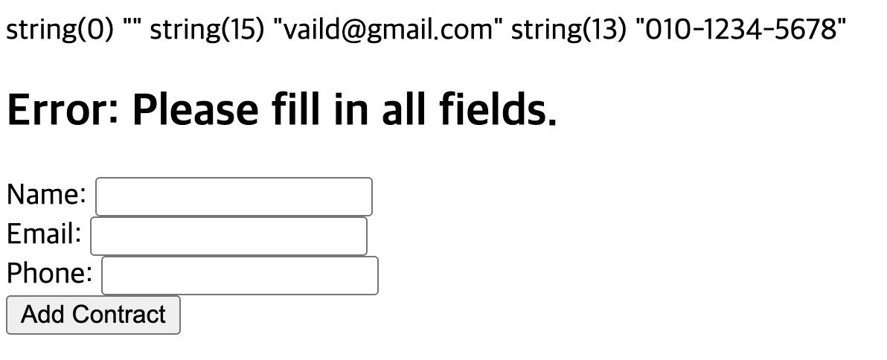
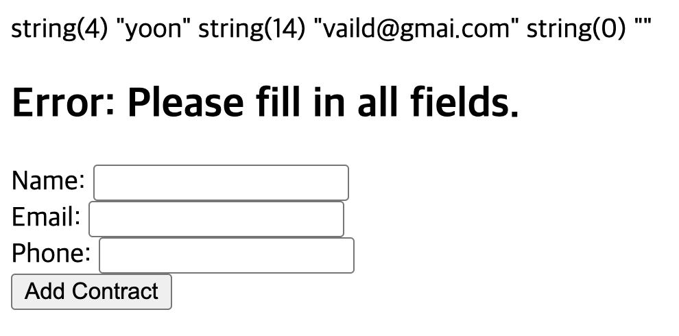
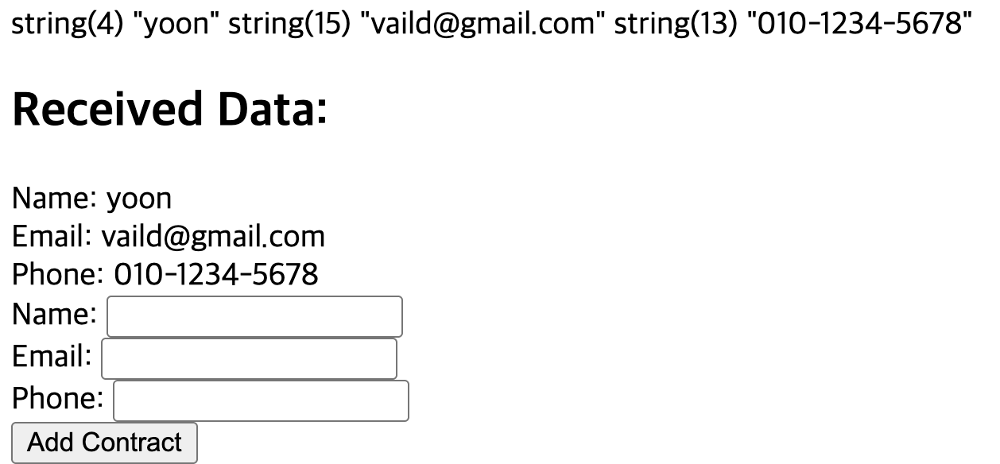

## 8. File upload & delete

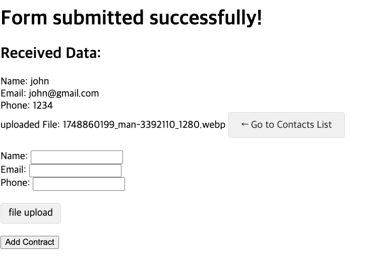

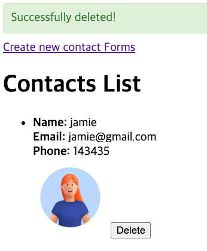